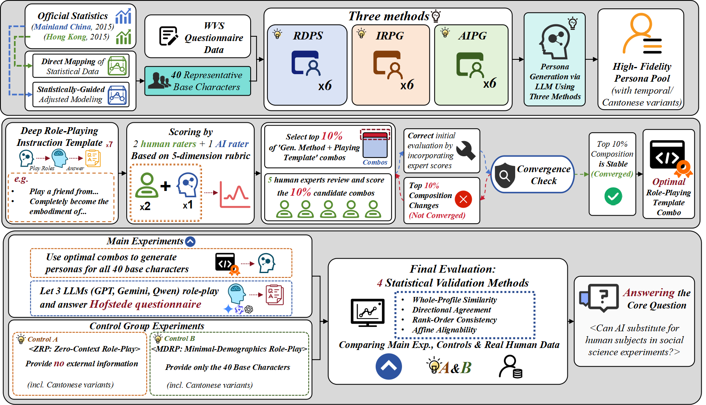

# The-Cultural-Turing-Test
Source code of the paper "The Cultural Turing Test: Can LLMs Replace Human Subjects in Sociological Studies?".
# Phased Persona Generation, Model Evaluation, and VSM-Based Analysis

This repository provides research code organized into three phases:
Phase I (persona construction/translation), Phase II (LLM response generation and automated scoring), and Phase III (quantitative analysis, including VSM-style indices and statistical tests).

Modules are designed to be imported and orchestrated by an external runner (e.g., notebooks or pipelines); direct script entry points have been removed to avoid unintentional execution.

**Configuration.** Networked model calls expect credentials via environment variables: `OPENAI_API_KEY` (required) and `OPENAI_BASE_URL` (optional).

**Reproducibility.** For archival use, record the Python version, dependency versions, and the exact repository revision (commit hash) used to produce reported results.
